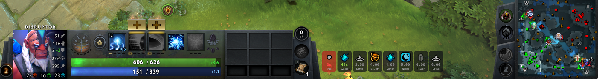

# dota-clock

A transparent overlay that shows upcoming Dota 2 game events using Game State Integration (GSI). Supports Linux (Wayland) and Windows.



## Features

- Transparent click-through overlay (gtk4-layer-shell on Linux, Win32 on Windows)
- Countdown timers for runes, lotus pools, wisdom shrines, outposts, day/night, tormentor, neutral item tiers, siege creeps
- Pull and stack timing indicators
- Sub-second accurate clock synced to GSI
- Auto-hides when not in a game
- Horizontal or vertical layout
- Patch-based timing system — all event and recurring timings are defined per-patch in `src/patches/`
- System tray icon with quit option (Windows)

## Setup

### Build

```sh
# Linux
nix build
# or: nix develop && cargo build --release

# Windows (cross-compile from Linux)
just build-windows

# Windows (native)
cargo build --release
```

### Install GSI config

Copy `gamestate_integration_dotaclock.cfg` to your Dota 2 GSI config directory:

```sh
# Linux
cp gamestate_integration_dotaclock.cfg ~/.steam/steam/steamapps/common/dota\ 2\ beta/game/dota/cfg/gamestate_integration/

# Windows
copy gamestate_integration_dotaclock.cfg "C:\Program Files (x86)\Steam\steamapps\common\dota 2 beta\game\dota\cfg\gamestate_integration\"
```

### Run

```sh
./result/bin/dota-clock
```

The overlay appears when a game starts and hides otherwise.

**Windows note:** Dota 2 must be in **Borderless Window** mode (Settings > Video > Display Mode) for the overlay to render on top.

## Configuration

Config file location:
- Linux: `~/.config/dota-clock/config.toml`
- Windows: `%APPDATA%\dota-clock\config.toml`

Created with defaults on first run:

```toml
anchor = "bottom-right"   # bottom-right, bottom-left, top-right, top-left
margin_bottom = 10
margin_right = 470
margin_top = 0
margin_left = 0
icon_size = 40
max_icons = 10
vertical = false
```

## Adding a new patch

Create a new file in `src/patches/` (e.g. `v7_42.rs`) implementing the `Patch` trait, then update `latest()` in `src/patches/mod.rs` to point to it.
